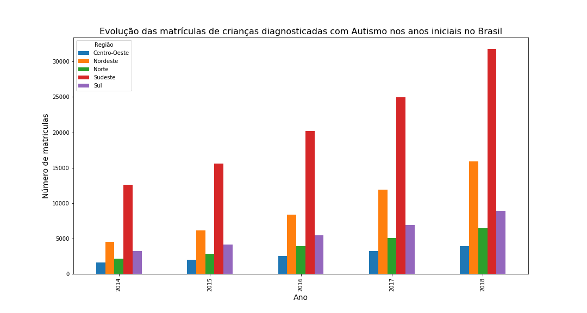
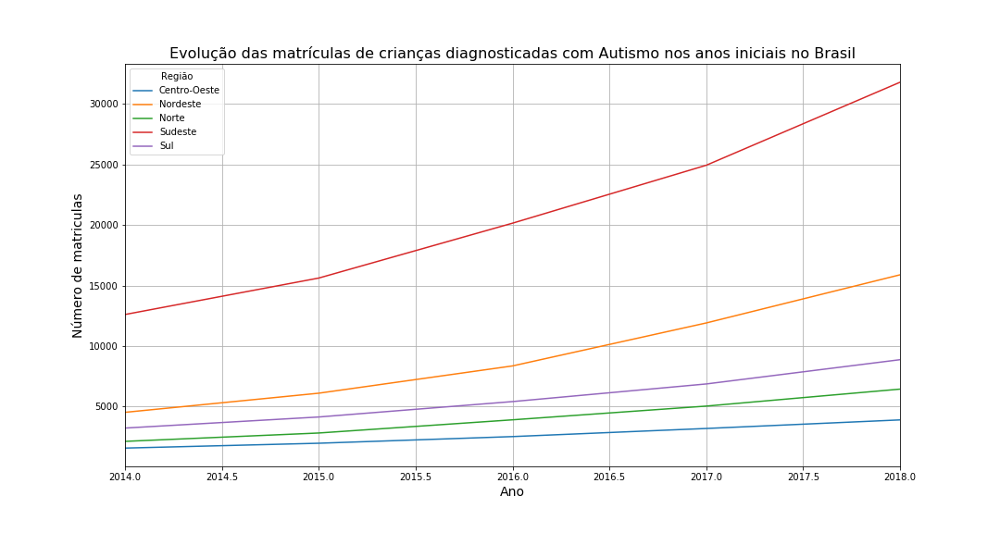

# Analise_Dados_INEP_Autismo

**Evolução das matrículas de crianças diagnosticada com Autismo com base nos Dados do INEP, dos anos de 2014 à 2018.**

Desenvolvido por Cristiane e Diego

Criado com Python 3.7.4 (64-bits)

Instruções de Uso

A - Para utilizar este repositório é preciso baixar e instalar as bibliotecas necessárias:

Abra o Prompt de Comando do Windows
Navegue até a pasta descompactada desse repositório: cd Endereço_da_Pasta
Digite: pip install -r requirements.txt 
B - Baixar os arquivos de dados da Educação Básica de 2014, 2015, 2016, 2017 e 2018. Esses arquivos estão disponíveis na página do INEP (http://inep.gov.br/dados)

C - Para a análise, descompactar dentro da pasta do repositório apenas os dados relativos as Matrículas de todas as regiôes.

D - Renomear os arquivos no seguinte padrão REGIÃO_ANO.CSV:
Ex. :MATRICULAS_CO.CSV (dados de 2018) para CENTRO-OESTE_2018.CSV

E - Por fim feitos todos os procedimentos digitar no Prompt de Comando: jupyter notebook

Gráfico das evoluções de todo o Brasil, o repositório apresenta os dados por região:

Gráfico em ordem crescente:

